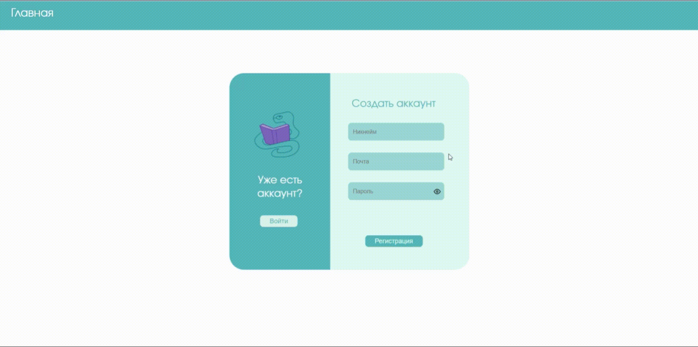

# Название проекта: Python Skillset

## Описание проекта
Python Skillset - это сайт-платформа для обучения, который предоставляет возможность пользователям изучать язык программирования python. Сайт включает в себя курс с лекциями, тесты и практические задания, которые помогут пользователям улучшить свои знания и навыки.

## Функциональность
На сайте пользователи могут:
- Регистрироваться и авторизовываться
- Изучать курс по языку программирования Python
- Проходить тесты для проверки своих знаний

## Технологии
 Для фронтенда используется HTML, CSS и JavaScript. Для запуска веб-приложения на локальном сервере можно использовать Live Server; Шрифт текста - Evolvent
  [Ссылка по клику на бэк](https://github.com/Nermey/Subjectum)

## Установка
Для установки проекта необходимо выполнить следующие шаги:
1. Склонировать репозиторий на свой компьютер
2. Запустить Live Server

## Авторы
Проект разработан командой разработчиков:
- Елизарьев Александр 
- Бех София 
- Сергунцов Роман
- Гогохия Лука

